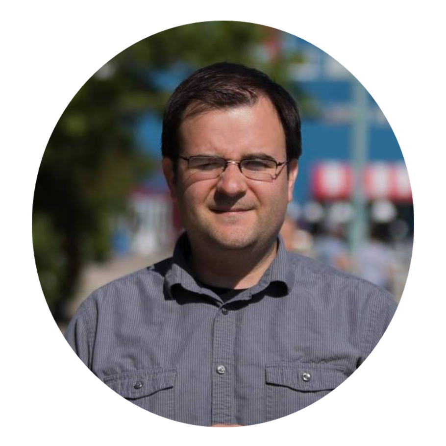
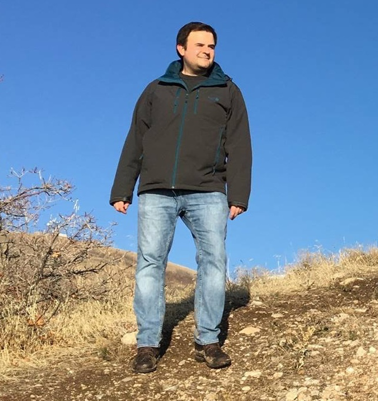

<!---
 
-->

   

## About Me

I'm currently a Postdoctoral Fellow at the <a href="https://www.clsp.jhu.edu/">Center for Language and Speech Processing</a> at <a href="https://www.jhu.edu/">Johns Hopkins University</a>, where I'm one of the main members of the <a href="http://www.unimorph.org">UniMorph</a> project. Before coming to JHU, I was a Postdoctoral Assistant Professor at the <a href="https://linguistics.georgetown.edu/">Georgetown Linguistics Department</a>. 

I received my B.A. in Computer Science and Linguistics from New York University (advisor: Adamantios Gafos), and my Ph.D. in Cognitive Science from Johns Hopkins (advisor: Colin Wilson). My current work spans multiple topics in Natural Language Processing (NLP) and Computational Linguistics. I have a special interest in NLP for low-resource, morphologically rich languages, including morphological learning, tagging, and machine translation. I lean heavily on state-of-the-art machine learning methods, especially deep learning neural networks. I'm also interested in improving these models by focusing on system interpretability and understanding how their internal operations and representations relate to human language performance.

**Details**

[Google Scholar](https://scholar.google.com/citations?user=OPQn46oAAAAJ&hl=en)

[**CV**](cv/latest.pdf)

**Contact**

ckirov gmail com

## Current Activities

The **UniMorph** project provides morphologically-annotated lexical data and tools spanning a large, typologically diverse set of languages. Check [here](http://www.github.org) for an overview, or jump to our data portal [here](https://unimorph.github.io/).

UniMorph is supported by the DARPA **LORELEI** (Low Resource Languages for Emergent Incidents) program, which is focused on developing language technologies to facilitate communication in disaster-prone areas of the world where translators are scarce.

I am one of the organizers of the **CoNLL-SIGMORPHON 2018** shared task on morphological learning. Thanks to resources provided by UniMorph, the shared task covers over 100 languages! Check it out [here](https://sigmorphon.github.io/sharedtasks/2018/).

## Software

See my GitHub page [here](https://github.com/ckirov/).

Morphological analysis software developed as part of UniMorph is available [here](https://github.com/unimorph/analyzers).

## Publications

**Christo Kirov** and Ryan Cotterell (2018). _Recurrent Neural Networks in Linguistic Theory: Revisiting Pinker and Prince (1988) and the Past Tense Debate_. TACL. (to appear)

Ryan Cotterell, **Christo Kirov**, Mans Hulden, and Jason Eisner (2018). _On the Diachronic Stability of Irregularity in Inflectional Morphology_. NAACL. (arxiv)

Ryan Cotterell, **Christo Kirov**, Sebastian J. Mielke, and Jason Eisner (2018). _Unsupervised Disambiguation of Syncretism in Inflected Lexicons_. NAACL. New Orleans, Louisiana.

**Christo Kirov**, Ryan Cotterell, John Sylak-Glassman, Géraldine Walther, Ekaterian Vylamova, Patrick Xia, Manaal Faruqui, Sandra Kübler, David Yarowsky, Jason Eisner, and Mans Hulden (2018). _UniMorph 2.0: Universal Morphology_.  LREC. Miyazaki, Japan.

Steven Shearing, **Christo Kirov**, Huda Khayrallah, and David Yarowsky (2018). _Improving Low Resource Machine Translation with Morphological Glosses_. AMTA. Boston, Massachusetts.

Robert Churchill, Lisa Singh, and **Christo Kirov** (2018). _A Temporal Topic Model for Noisy Mediums_. PAKDD. Melbourne, Australia.

Ryan Cotterell, **Christo Kirov**, Mans Hulden, and Jason Eisner (2017). _On the Complexity and Typology of Inflectional Morphological Systems_. TACL.

Ryan Cotterell, Ekaterina Vylamova, Huda Khayrallah, **Christo Kirov**, and David Yarowsky (2017). _Paradigm Completion for Derivational Morphology_. EMNLP. Copenhagen, Denmark.

Ryan Cotterell, **Christo Kirov**, John Sylak-Glassman, Géraldine Walther, Ekaterina Vylamova, Patrick Xia, Manaal Faruqui, Sandra Kübler, David Yarowsky, Jason Eisner, and Mans Hulden (2017). _CoNLL-SIGMORPHON 2017 Shared Task: Universal Morphological Reinflection in 52 Languages_. CoNLL. Vancouver, Canada.

**Christo Kirov**, John Sylak-Glassman, Ryan Cotterell, Rebecca Knowles, and Matt Post (2017). _A Rich Morphological Tagger for English: Exploring the Cross-Linguistic Tradeoff Between Morphology and Syntax_. EACL. Valencia, Spain.

Ryan Cotterell, **Christo Kirov**, and John Sylak-Glassman (2017). _Neural Graphical Models over Strings for Principal Parts Morphological Paradigm Completion_. EACL. Valencia, Spain. **Outstanding Paper Award**.

Ryan Cotterell, **Christo Kirov**, John Sylak-Glassman, David Yarowsky, Jason Eisner, and Mans Hulden (2016). _The SIGMORPHON 2016 Shared Task - Morphological Reinflection_. Proceedings of the 2016 Meeting of SIGMORPHON. ACL. Linguistics. Berlin, Germany.

**Christo Kirov**, John Sylak-Glassman, Roger Que, and David Yarowsky (2016). _Very-large Scale Parsing and Normalization of Wiktionary Morphological Paradigms_.  LREC. Portoroz, Slovenia.

John Sylak-Glassman, **Christo Kirov**, and David Yarowsky (2016)._Remote Elicitation of Inflectional Paradigms to Seed Morphological Analysis in Low-Resource Languages_. LREC. Portoroz, Slovenia.

John Sylak-Glassman, **Christo Kirov**, David Yarowsky, and Roger Que (2015). _A Language-Independent Feature Schema for Inflectional Morphology_. ACL. Beijing, China.

John Sylak-Glassman, **Christo Kirov**, David Yarowsky, and Roger Que (2015). _A Universal Schema for Rich Morphological Annotation_.  SFCM. Stuttgart, Germany.

**Christo Kirov** and Colin Wilson (2013). _Bayesian Speech Production: Evidence from Latency and Hyperarticulation_. COGSCI. Berlin, Germany.

**Christo Kirov** and Colin Wilson (2012). _The Specificity of Online Variation in Speech Production_. COGSCI. Sapporo, Japan.

**Christo Kirov** and Bob Frank (2011). _Processing of Nested and Cross-Serial Dependencies: an Automaton Perspective on SRN Behavior_. Connection Science. Volume 24. Issue 1. pp. 1-24. 

**Christo Kirov** and Adamantios Gafos (2010). _Assembling Phonological Representations. Phonological and Complex Adaptive Systems: Phonology and Complexity_. Chitoran, Coupe, Marsico, Pellegrino (eds.), Mouton de Gruyter, Berlin/New York. 

**Christo Kirov** and Adamantios Gafos (2007). _Dynamic Phonetic Detail in Lexical Representations_. ICPHS. Saarbrucken, Germany. pp. 637-640.

## Invited Talks

**Christo Kirov** (2017). _Computational Morphophonology - Bridging NLP and Linguistics_. University of Chicago.

**Christo Kirov** (2017). _Morphological Modeling for Multi-lingual NLP_. GUCL. Georgetown University.

**Christo Kirov** (2016). _Building Strong Inductive Baselines for Computational Morphophonology_. New York University.

**Christo Kirov** (2016). _UniMorph - Universal Morphology at JHU_. Center For Language and Speech Processing Seminar Series. Johns Hopkins University. [Video](http://www.clsp.jhu.edu/seminars/seminar-videos/)

**Christo Kirov** (2015). The Consequences of Bayesian Decision-Making in Speech Production. Common Ground Speaker Series. University of Pennsylvania.

## Presentations

Ryan Cotterell, **Christo Kirov**, Mans Hulden, and Jason Eisner (2018). _The Pareto Complexity of Inflectional Systems_. SCIL. Salt Lake City, Utah.

**Christo Kirov** (2017). _Recurrent Neural Networks as a Strong Baseline for Morphophonological Learning_. LSA. Austin, TX. 

John Sylak-Glassman, **Christo Kirov**, David Yarowsky, and Roger Que (2015). _Typology Enriching NLP: A Universal Schema for Inflectional Morphology_. ALT. New Mexico.

**Christo Kirov** (2014). _Grammatical Influences in a Bayesian Speech Production Framework_. COGSCI. Quebec City, Quebec.

**Christo Kirov** and Colin Wilson (2013). _Modeling the Relationship Between Competition, Latency, and Articulation_. LSA. Boston, MA.

**Christo Kirov** and Colin Wilson (2012). _How Phonological Context Affects Phonetic Realization_.  LABPHON. Stuttgart, Germany.

**Christo Kirov** and Colin Wilson (2012). _Modeling Speech Production with Bayesian Inference:  Competition, Latency, and Articulation_. APCAM. Minneapolis, MN.

**Christo Kirov** and Colin Wilson (2012). _Specificity of Online Variation in Speech Production_.  LSA, Portland, Oregon.

**Christo Kirov** and Colin Wilson (2011). _Explaining Online Hyperarticulation in Speech Production_. NECPHON, Yale University, New Haven, Connecticut.

**Christo Kirov** (2008). _Forward and Reverse Recall in Simple Recurrent Networks_. COGSCI, Washington, D.C.

## Teaching

**Natural Language Processing** (Georgetown University, Fall 2014)

**Phonology/Phonetics I** (Johns Hopkins University, Spring 2014)

**Computational Phonology** (Georgetown University, Spring 2014)

**Computational Corpus Linguistics** (Georgetown University, Fall 2013)

**Computational Corpus Linguistics** (Georgetown University, Fall 2012)
