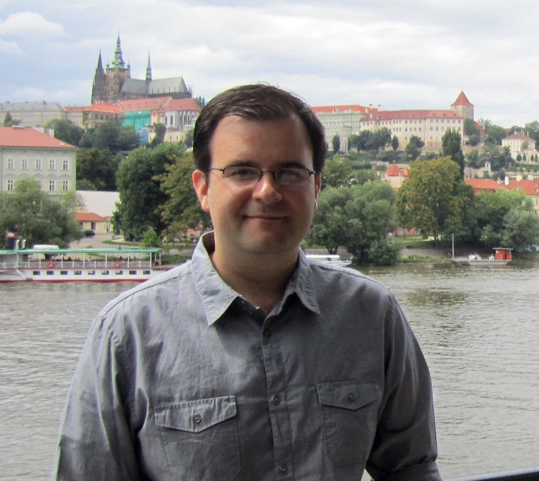

 My interests span across topics in natural language processing, computational linguistics, linguistics, and cognitive science. I am a member of the UniMorph project (unimorph.org) in the Center for Language and Speech Processing at JHU.

For more information on UniMorph, see (unimorph.org) and (unimorph.github.io). 

UniMorph data hasbeen the backbone recenter shared tasks in computational morphology.

**Contact**

ckirov gmail com

[**CV**](cv/latest.pdf)

## Publications

**Christo Kirov**, Ryan Cotterell, John Sylak-Glassman, Géraldine Walther, Ekaterian Vylamova, Patrick Xia, Manaal Faruqui, Sandra Kübler, David Yarowsky, Jason Eisner, and Mans Hulden (2018). _UniMorph 2.0: Universal Morphology_.  LREC. Miyazaki, Japan.

Steven Shearing, **Christo Kirov**, Huda Khayrallah, and David Yarowsky (2018). _Improving Low Resource Machine Translation with Morphological Glosses_. AMTA. Boston, Massachusetts.

Robert Churchill, Lisa Singh, and **Christo Kirov** (2018). _A Temporal Topic Model for Noisy Mediums_. PAKDD. Melbourne, Australia.

Ryan Cotterell, **Christo Kirov**, Mans Hulden, and Jason Eisner (2017). _On the Complexity and Typology of Inflectional Morphological Systems_. TACL.

Ryan Cotterell, Ekaterina Vylamova, Huda Khayrallah, **Christo Kirov**, and David Yarowsky (2017). _Paradigm Completion for Derivational Morphology_. EMNLP. Copenhagen, Denmark.

Ryan Cotterell, **Christo Kirov**, John Sylak-Glassman, Géraldine Walther, Ekaterina Vylamova, Patrick Xia, Manaal Faruqui, Sandra Kübler, David Yarowsky, Jason Eisner, and Mans Hulden (2017). _CoNLL-SIGMORPHON 2017 Shared Task: Universal Morphological Reinflection in 52 Languages_. CoNLL. Vancouver, Canada.

**Christo Kirov**, John Sylak-Glassman, Ryan Cotterell, Rebecca Knowles, and Matt Post (2017). _A Rich Morphological Tagger for English: Exploring the Cross-Linguistic Tradeoff Between Morphology and Syntax_. EACL. Valencia, Spain.

Ryan Cotterell, **Christo Kirov**, and John Sylak-Glassman (2017). _Neural Graphical Models over Strings for Principal Parts Morphological Paradigm Completion_. EACL. Valencia, Spain. **Outstanding Paper Award**.

Ryan Cotterell, **Christo Kirov**, John Sylak-Glassman, David Yarowsky, Jason Eisner, and Mans Hulden (2016). _The SIGMORPHON 2016 Shared Task - Morphological Reinflection_. Proceedings of the 2016 Meeting of SIGMORPHON. ACL. Linguistics. Berlin, Germany.

**Christo Kirov**, John Sylak-Glassman, Roger Que, and David Yarowsky (2016). _Very-large Scale Parsing and Normalization of Wiktionary Morphological Paradigms_.  LREC. Portoroz, Slovenia.

John Sylak-Glassman, **Christo Kirov**, and David Yarowsky (2016)._Remote Elicitation of Inflectional Paradigms to Seed Morphological Analysis in Low-Resource Languages_. LREC. Portoroz, Slovenia.

John Sylak-Glassman, **Christo Kirov**, David Yarowsky, and Roger Que (2015). _A Language-Independent Feature Schema for Inflectional Morphology_. ACL. Beijing, China.

John Sylak-Glassman, **Christo Kirov**, David Yarowsky, and Roger Que (2015). _A Universal Schema for Rich Morphological Annotation_.  SFCM. Stuttgart, Germany.

**Christo Kirov** and Colin Wilson (2013). _Bayesian Speech Production: Evidence from Latency and Hyperarticulation_. COGSCI. Berlin, Germany.

**Christo Kirov** and Colin Wilson (2012). _The Specificity of Online Variation in Speech Production_. COGSCI. Sapporo, Japan.

**Christo Kirov** and Bob Frank (2011). _Processing of Nested and Cross-Serial Dependencies: an Automaton Perspective on SRN Behavior_. Connection Science. Volume 24. Issue 1. pp. 1-24. 

**Christo Kirov** and Adamantios Gafos (2010). _Assembling Phonological Representations. Phonological and Complex Adaptive Systems: Phonology and Complexity_. Chitoran, Coupe, Marsico, Pellegrino (eds.), Mouton de Gruyter, Berlin/New York. 

**Christo Kirov** and Adamantios Gafos (2007). _Dynamic Phonetic Detail in Lexical Representations_. ICPHS. Saarbrucken, Germany. pp. 637-640.

## Presentations

Cotterell, Ryan, Kirov, Christo, Hulden, Mans, and Eisner, Jason. 2018. The Pareto Complexity of Inflectional Systems. SCIL. Salt Lake City, Utah.

Sylak-Glassman, John, Kirov, Christo, Yarowsky, David, and Que, Roger. 2015. Typology Enriching NLP: A Universal Schema for Inflectional Morphology. ALT. New Mexico.

Kirov, Christo and Wilson, Colin. 2013. Modeling the Relationship Between Competition, Latency, and Articulation. LSA. Boston, MA.

Kirov, Christo and Wilson, Colin. 2012. Modeling Speech Production with Bayesian Inference:  Competition, Latency, and Articulation. APCAM. Minneapolis, MN.

Kirov, Christo and Wilson, Colin. 2012.  Specificity of Online Variation in Speech Production.  LSA, Portland, Oregon.

Kirov, Christo. 2011. Explaining Online Hyperarticulation in Speech Production. NECPHON, Yale University, New Haven, Connecticut.

Kirov, Christo. 2017. Recurrent Neural Networks as a Strong Baseline for Morphophonological Learning. LSA. Austin, TX. 

Kirov, Christo. 2014. Grammatical Influences in a Bayesian Speech Production Framework. COGSCI. Quebec City, Quebec.

Kirov, Christo and Wilson, Colin. 2012. How Phonological Context Affects Phonetic Realization.  LABPHON. Stuttgart, Germany.

Kirov, Christo. 2008. Forward and Reverse Recall in Simple Recurrent Networks. COGSCI, Washington, D.C.

## Invited Talks

Kirov, Christo. 2017. Morphological Modeling for Multi-lingual NLP. GUCL. Georgetown University.

Kirov, Christo. 2016. UniMorph --- Universal Morphology at JHU. Center For Language and Speech Processing Seminar Series. Johns Hopkins University. Video: \\
http://www.clsp.jhu.edu/seminars/seminar-videos/

Kirov, Christo. 2015. The Consequences of Bayesian Decision-Making in Speech Production. Common Ground Speaker Series. University of Pennsylvania.

## Software Projects

## Teaching

Natural Language Processing (Georgetown University, Fall 2014)

Phonology/Phonetics I (Johns Hopkins University, Spring 2014)

Computational Phonology (Georgetown University, Spring 2014)

Computational Corpus Linguistics (Georgetown University, Fall 2013)

Computational Corpus Linguistics (Georgetown University, Fall 2012)
